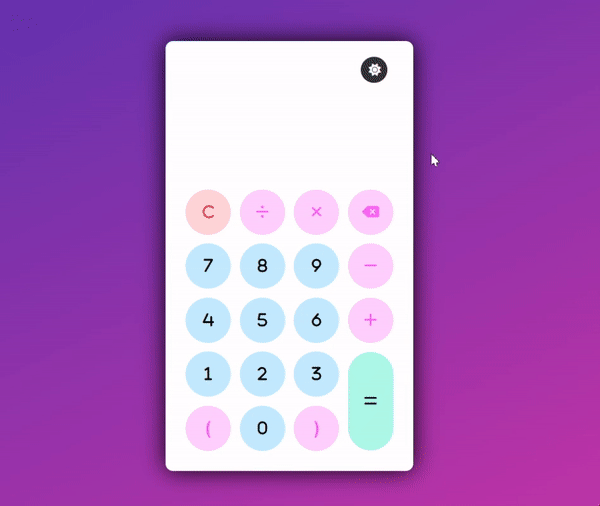

# Calculator

A Calculator App with dark mode. Built using HTML, CSS and JavaScript. Feel free to check out the code and don't forget to star the repo.⭐

## Demo

## Controls

There are total two ways to interact with calculator: -

* Interactive GUI :

* Keyboard Input :
    * Use numerical keys to give input.
    * Use operator keys to give input.
    * Use decimal point to give decimal point.
    * Use c key to clear current output.
    * Use backspace to clear one recently added symbol.
    * Hit enter after the valid expression so that it prints final result.
    
        
## Live Demo

See Live Demo [ Here ](https://nikhilhaspe.github.io/Calculator/)
